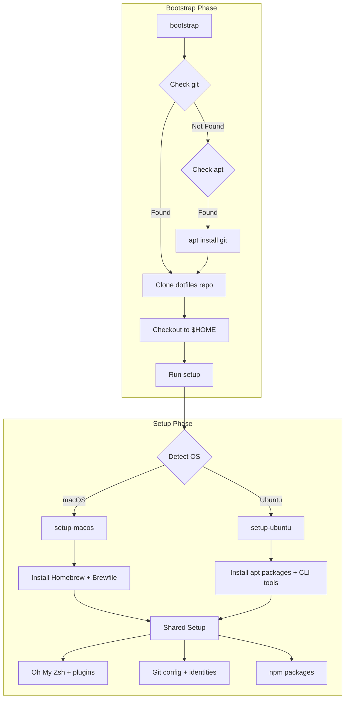

# Script Directory

Scripts for managing this dotfiles repository and setting up development environments.

## Architecture

This setup supports **macOS** and **Ubuntu** through a modular architecture:



## Files

| File | Purpose |
|------|---------|
| [`bootstrap`](./bootstrap) | 🚀 Entry point - clones dotfiles and installs git (via apt if missing) |
| [`setup`](./setup) | ⚙️ Unified entry point - detects OS and runs platform-specific setup + shared config |
| [`setup-macos`](./setup-macos) | 🍎 macOS - installs Homebrew and packages from Brewfile |
| [`setup-ubuntu`](./setup-ubuntu) | 🐧 Ubuntu - installs apt packages and modern CLI tools |
| [`ai-commit`](./ai-commit) | 🤖 AI-powered commit message generator |
| [`setup-git-hook`](./setup-git-hook) | 🪝 Git hook installer for AI commits |
| [`Brewfile`](./Brewfile) | 📦 Homebrew packages (macOS only) |
| [`lib/`](./lib) | 📚 Shared utilities and helper functions |

## Platform-Specific Packages

### macOS (via Homebrew)
Managed through [`Brewfile`](./Brewfile) - includes development tools, GUI apps, and CLI utilities.

### Ubuntu (hardcoded in setup-ubuntu)
**APT Packages:**
- Build tools: `build-essential`, `curl`, `wget`, `jq`
- Languages: `golang-go`
- Shell: `zsh`
- System: `btop`

**Modern CLI Tools:**
- `eza` - Modern ls replacement
- `fnm` - Fast Node Manager
- `go-task` - Task runner
- `zoxide` - Smarter cd
- `uv` - Python package manager

## Shared Configuration (Cross-platform)

These are configured by the main [`setup`](./setup) script after platform-specific installation:

- **Zsh**: Oh My Zsh + Powerlevel10k + plugins
- **Git**: Global config, aliases, per-directory identities
- **npm**: Global packages (@anthropic-ai/claude-code, @google/gemini-cli, @github/copilot)

## Common Operations

### Sync Homebrew packages (macOS)
```sh
brew bundle dump --file=script/Brewfile --force --describe --no-vscode
```

### Add configuration files
```sh
dotfiles add <file_path>
dotfiles commit -m "Describe changes"
dotfiles push
```

### Update dotfiles on existing machine
```sh
dotfilesup
# or
$HOME/script/bootstrap -y
```

## Environment Variables

Create `script/.env` from [`.env.sample`](./.env.sample) and configure:

- `GIT_USER_NAME` / `GIT_USER_EMAIL` - Global Git identity
- `ONELAB_EMAIL` - Git identity for ~/repos/onelab
- `ASCENTISTECH_EMAIL` - Git identity for ~/repos/ascentistech
- `ONELAB_NUGET_URL` - NuGet source (optional)
- `OPENAI_API_KEY` - For AI commit features (optional)
