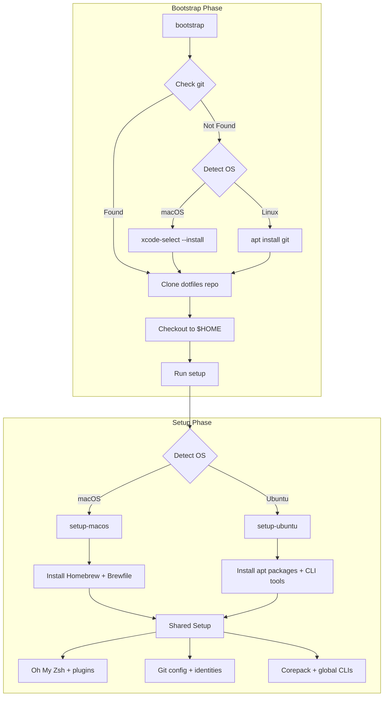

# Script Directory

Scripts for managing this dotfiles repository and setting up development environments.

## Architecture

This setup supports **macOS** and **Ubuntu** through a modular architecture:


```mermaid
graph TB
    subgraph "Bootstrap Phase"
        A[bootstrap] --> B{Check git}
        B -->|Found| D
        B -->|Not Found| C{Detect OS}
        C -->|macOS| E1[xcode-select --install]
        C -->|Linux| E2[apt install git]
        E1 --> D[Clone dotfiles repo]
        E2 --> D
        D --> F[Checkout to $HOME]
        F --> G[Run setup]
    end

    subgraph "Setup Phase"
        G --> H{Detect OS}
        H -->|macOS| I[setup-macos]
        H -->|Ubuntu| J[setup-ubuntu]
        I --> K[Install Homebrew + Brewfile]
        J --> L[Install apt packages + CLI tools]
        K --> M[Shared Setup]
        L --> M
        M --> N[Oh My Zsh + plugins]
        M --> O[Git config + identities]
        M --> P[Corepack + global CLIs]
    end
```

## Files

| File                                 | Purpose                                                                                   |
| ------------------------------------ | ----------------------------------------------------------------------------------------- |
| [`bootstrap`](./bootstrap)           | 🚀 Entry point - clones dotfiles and installs git (via Xcode CLT on macOS, apt on Ubuntu) |
| [`setup`](./setup)                   | ⚙️ Unified entry point - detects OS and runs platform-specific setup + shared config      |
| [`setup-macos`](./setup-macos)       | 🍎 macOS - installs Homebrew and packages from Brewfile                                   |
| [`setup-ubuntu`](./setup-ubuntu)     | 🐧 Ubuntu - installs apt packages and modern CLI tools                                    |
| [`ai-commit`](./ai-commit)           | 🤖 AI-powered commit message generator                                                    |
| [`setup-git-hook`](./setup-git-hook) | 🪝 Git hook installer for AI commits                                                      |
| [`Brewfile`](./Brewfile)             | 📦 Homebrew packages (macOS only)                                                         |
| [`lib/`](./lib)                      | 📚 Shared utilities and helper functions                                                  |

## Platform-Specific Packages

### macOS (via Homebrew)

Managed through [`Brewfile`](./Brewfile) - includes development tools, GUI apps, and CLI utilities.

### Ubuntu (hardcoded in setup-ubuntu)

**APT Packages:**

- Build tools: `build-essential`, `curl`, `wget`, `gnupg`, `ca-certificates`, `git`, `jq`
- Shell: `zsh`
- Search/view: `ripgrep`, `fd-find`, `bat`
- System: `btop`

**Modern CLI Tools:**

- `eza` - Modern ls replacement
- `fnm` - Fast Node Manager
- `zoxide` - Smarter cd
- `uv` - Python package manager
- `task` - Task runner (via taskfile.dev installer into `~/.local/bin`)

## Shared Configuration (Cross-platform)

These are configured by the main [`setup`](./setup) script after platform-specific installation:

- **Zsh**: Oh My Zsh + Powerlevel10k + plugins
- **Git**: Global config, aliases, per-directory identities
- **Node.js**: Installed and version-managed by `fnm` (single source of truth; no Homebrew/system node). `fnm --use-on-cd` auto-switches versions per project.
- **Corepack**: Enables `pnpm`/`yarn` shims bound to the active Node version
- **Dev CLIs**: `task` (macOS: Homebrew `go-task`; Ubuntu: taskfile.dev installer) and GitHub Copilot CLI (macOS: Homebrew `copilot-cli` cask)
- **AI CLIs**: Claude Code (`claude`) and Antigravity (`agy`) via their official install scripts

## Common Operations

### Sync Homebrew packages (macOS)

```sh
brew bundle dump --file=script/Brewfile --force --describe --no-vscode --no-npm
```

### Add configuration files

```sh
dotfiles add <file_path>
dotfiles commit -m "Describe changes"
dotfiles push
```

### Update dotfiles on existing machine

```sh
dotfilesup
# or
$HOME/script/bootstrap -y
```

## Environment Variables

Create `script/.env` from [`.env.sample`](./.env.sample) and see the file for configuration details.
